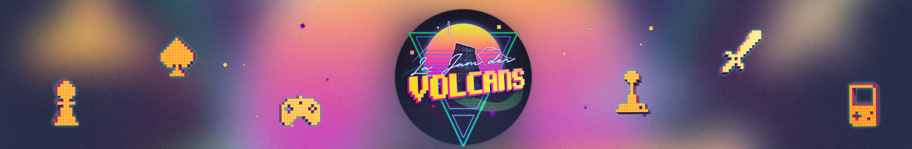

# ~~Game-Jam~~Marathon-de-développement-de-jeux-03-03-2023 : Jam des Volcans
[](https://jam-des-volcans.fr/)


**Date :** 03-05 mars 2023   
**Thème :** Construire pour détruire !  
**Nom du jeu :** Club sandwich  
**Type de jeu :** Pointe & Clic *(#glisserdéposer)*  

---
## Membre de l'équipe :
MEUNIER Valentin  
PREVOT Pierre  
VILLEDIEU DE TORCY Mathieu    

---
## Code

**Compilation :** 
```bash
CFAIRE=cmake && FAIRE=make
$CFAIRE . && $FAIRE -j && ./clubSandwich.exe
```  

---  
## Pitch du jeu 

Le but du jeu est de réaliser le plus d’accidents possibles dans les différentes pièces du couloir. Pour ce faire, certains objets peuvent être déplacés et combinés avec d’autres.  

Mais que se passe-t-il si on met les ciseaux dans la prise ? À vous de le découvrir *(dans le jeu, pas dans la vraie vie !)* en parcourant les différentes salles du couloir. Bon jeu ! 😉  

# Déroulé du jeu
Le jeu ne contient que deux salles avec un nombre limité d'objets. Une fois toutes les accidents réalisés dans une pièce (pas d'indicateur), il faut cliquer sur la flèche de retour (en haut à gauche) pour changer de salle en passant par le couloir.

Dans la pièce 1 :
- mettre les ciseaux dans la prise
- allumer un feu dans la poubelle avec les allumettes
- amplifier le feu avec le produit inflammable qui est dans l'armoire

Dans la pièce 2 :
- casser les 2 néons avec le brise glace à coté de la porte
- mettre le canapé devant l'issue de secours (pas implémenté)

## Repas de fin de semaine

### Vendredi 
#### Repas du soir 
Apéro : Chips + TUC + bretzel   
Boissons :  soda (coca, oasis, ice-tea)  

Buffet avec pizza : 
* Grande Pizzaiolo (base tomate)
* Grande Bolognaise (base tomate)
* Grande Calabraise (base tomate)
* Grande Cortina (base tomate, sans fromage)
* Grande Moussaka (base tomate, fromage)

### Samedi
#### Petit-déjeuner 
Pain au chocolat  
Croissant  
Brioche   

Boison :
* Café 
* Thé
* Jus d'orange
* Jus multifruit
* Jus de pomme

#### Repas du midi 
Buffet : 
* Salade de pattes (jambon, mozza, tomate cerise, tomates séchées, pesto)  
* Salade de pattes (jambon, mozza, tomates séchées)  
* Tranches de jambon  
* Quiche épinard/chèvre
* Cake tomates séchées
* Cake jambon
* Muffin banana bread
* Banana bread  
* Fromages (st-nectaire, cantal, bleu d'auvergne)
* Pain

#### Repas du soir
Buffet :
* Salade de pattes (jambon, mozza, tomate cerise, tomates séchées, pesto)  
* Salade de pattes (jambon, mozza, tomates séchées)  
* Tranches de jambon  
* Charcuterie
* Rotie de boeuf
* Rotie de porc
* Poulet
* Salade auvergante
* Salade ZZ-haricots
* Salade paysanne
* Fromages (st-nectaire, bleu d'auvergne)
* Clafoutis à la prune 
* Tarte aux pommes


### Dimanche 
#### Petit déjeuné 
Pain au chocolat  
Croissant  
Brioche  

Boison :
* Café 
* Thé
* Jus d'orange
* Jus multifruit
* Jus de pomme  

#### Repas du midi 
Buffet :   
* Salade de pattes (jambon, mozza, tomate cerise, tomates séchées, pesto)  
* Salade de pattes (jambon, mozza, tomates séchées)  
* Tranches de jambon  
* Quiche épinard/chèvre
* Cake tomates séchées
* Cake jambon
* Poulet
* Muffin ~~banana bread~~ pain aux bananes
* Banana bread  
* Fromages (st-nectaire, cantal)
* Pain  

#### Repas du soir 
* Mini-patisserie   
* Mini-wrap   
* Gougères
* Allumettes   

---
## Évènements divers
* Plusieurs parties sur le jeu [Riding Seas](https://store.steampowered.com/app/1428140/Riding_Seas/)   

---
## Objectifs

- [X] Noter tous les repas dans le ~~README~~LISEZMOI  
- [X] Avoir un super système de glisser-déposer
- [X] Avoir un executable   
- [X] Test du jeu [Riding Seas](https://store.steampowered.com/app/1428140/Riding_Seas/)
- [ ] Test de la démo du jeu [Twistales](https://store.steampowered.com/app/2279160/Twistales/) avec les développeurs
- [X] Ecrire le code en Français premier (ie les noms de variables et méthodes en français)  
- [X] Traduire l'intégralité du code en français 🥖&🥐 > 🫖&🍵 
